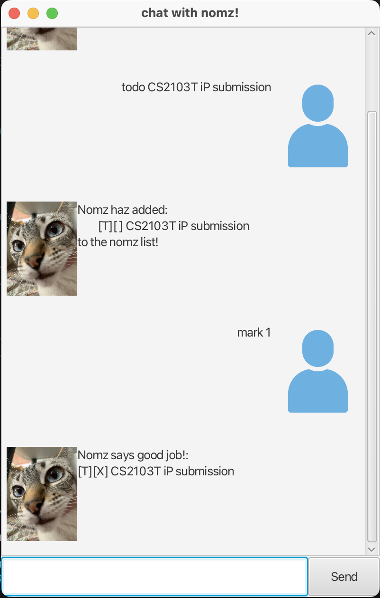

# Nomz

Nomz User Guide



Nomz is a simple, intuitive task manager for students and busy professionals. It helps you keep track of todos, deadlines, and events, with tagging and search features for easy organization.

## Features

- Add todos, deadlines, and events
- Mark and unmark tasks as done
- Delete tasks
- Tag tasks for easy filtering
- Find tasks by keyword
- Save and load tasks automatically

## Getting Started

Launch Nomz and enter commands in the input box. Your tasks are saved automatically.

## Adding a Todo

Adds a simple task to your list.

**Usage:**

```
todo <description>
```

**Example:**

```
todo read book
```

## Adding a Deadline

Adds a task with a due date/time.

**Usage:**

```
deadline <description> /by <date/time>
```

**Example (With Date Time):**

```
deadline submit assignment /by 2025-09-20 23:59
```

**Example (With String):**

```
deadline submit assignment /by tomorrow
```

## Adding an Event

Adds an event with a start and end time.

**Usage:**

```
event <description> /from <start date/time> /to <end date/time>
```

**Example (With Date Time):**

```
event project meeting /from 2025-09-20 12:00 /to 2025-09-20 13:00
```

**Example (With String):**

```
event project meeting /from 3pm /to 4pm
```

## Marking/Unmarking a Task

Marks or unmarks a task as done. Use [list](#listing-tasks) to see task number!

**Usage:**

```
mark <task number>
unmark <task number>
```

**Example:**

```
mark 2
unmark 2
```

## Deleting a Task

Deletes a task from your list. Use [list](#listing-tasks) to see task number!

**Usage:**

```
delete <task number>
```

**Example:**

```
delete 3
```

## Tagging a Task

Adds a tag to a task for easy filtering. Use [list](#listing-tasks) to see task number!

**Usage:**

```
tag <task number> <tag>
```

**Example:**

```
tag 1 urgent
```

## Finding Tasks

Finds tasks containing a keyword.

**Usage:**

```
find <keyword>
```

**Example:**

```
find assignment
```

## Listing Tasks

Shows all tasks in your list.

**Usage:**

```
list
```

## Exiting Nomz

Closes the application.

**Usage:**

```
bye
```

## Tips

- Dates can be entered with or without time (i.e `yyyy-MM-dd HHmm` or `yyyy-MM-dd`)
- Dates can be entered in formats like `yyyy-MM-dd HHmm` or `d/M/yyyy HH:mm`.
- You can tag tasks with multiple tags separated by commas.
- All data is saved automatically; no need to save manually.

## Troubleshooting

- If you see errors, check your command format and ensure all required arguments are present.
- For date/time errors, use valid formats and real dates (e.g., no Feb 30).

## Contact

For help or feedback, contact the Nomz team.